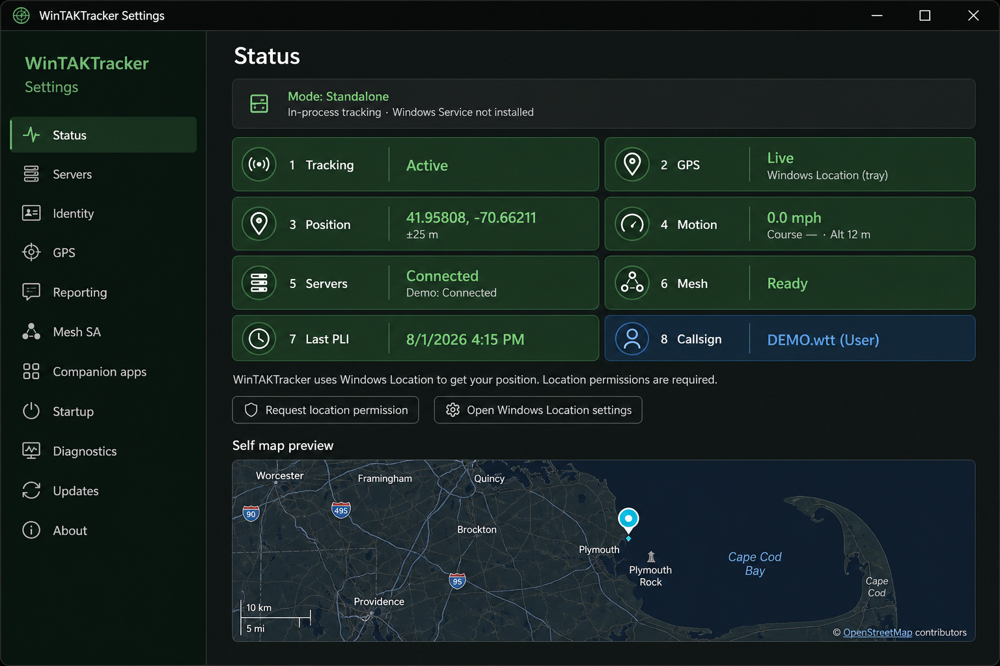
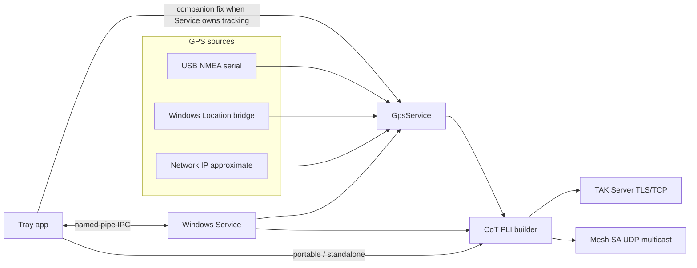
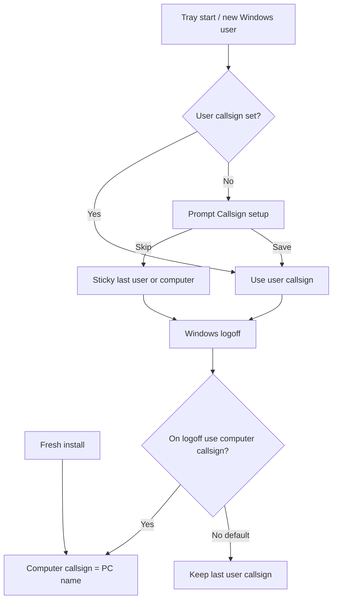
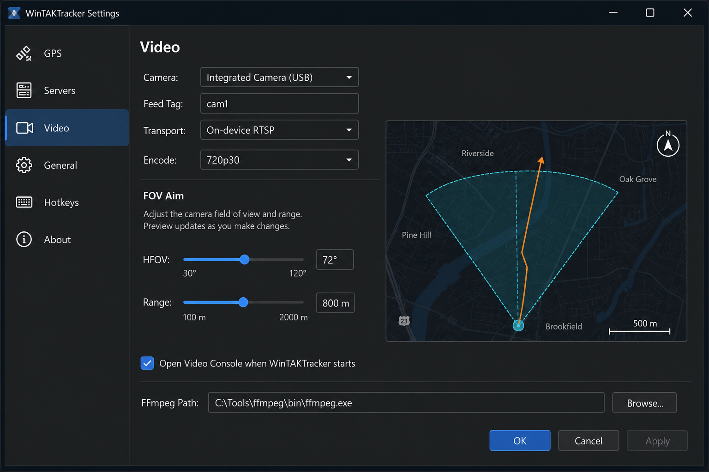
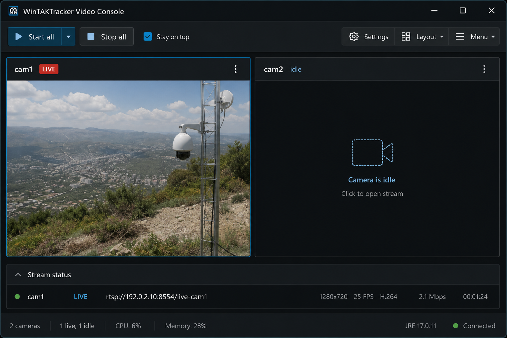

# WinTAKTracker

Lightweight **Windows TAK PLI tracker** that reports your position (self-SA CoT) to one or more TAK servers over TLS or TCP, and optionally broadcasts ATAK-compatible **Mesh SA** multicast on the LAN/VPN.

Optionally install as a **Windows Service** for always-on tracking after logoff; the tray app then acts as a controller (see [docs/windows-service.md](docs/windows-service.md)).



*Illustrative Status dashboard with sample location at Plymouth Rock (`41.9580775, -70.6621063`) and callsign `DEMO.wtt`. Screenshots may be refreshed as the UI evolves — not a live operational capture.*

WinTAKTracker is **tracking-only**. It does not host a common operating picture. Use a companion map client to see yourself and others:

| Companion | Platform |
|-----------|----------|
| [ATAK-CIV](https://play.google.com/store/apps/details?id=com.atakmap.app.civ) | Android |
| [TAK Aware](https://apps.apple.com/us/app/tak-aware/id6738631659) (iTAK family) | iOS |
| [WinTAK](https://tak.gov) | Windows |
| [TAK.gov](https://tak.gov) | Official TAK Product Center |

Not an official TAK Product Center application. TAK / ATAK / iTAK / WinTAK / CloudTAK / TAK Aware are trademarks of their respective owners.

## How it works



In **Setup** installs, the service owns tracking after logoff; the tray attaches over IPC and can bridge Windows Location from the interactive session. In portable mode, the tray runs tracking in-process.

## Callsign identity


| Situation | CoT callsign |
|-----------|----------------|
| Fresh install / nobody has set a user callsign | **Computer name** (or customized computer callsign) |
| Windows user logged in with “My callsign” set | **That user’s callsign** |
| User logs off, service still running (**default**) | **Last logged-in user’s callsign** (sticky) |
| Same, but Identity → **On logoff, use computer callsign** is checked | **Computer callsign** |
| New / unset user opens the tray | **Prompt** to set callsign (Skip dismisses until they set it in Settings) |



Details: [docs/windows-service.md](docs/windows-service.md#identity-rules).

## Video streaming (ICU-inspired)

Laptop or USB cameras can stream live video and advertise it over TAK CoT so **ATAK**, **CloudTAK**, and **TAK Aware** can open the feed (ICU-style discovery). Setup stays in **Settings → Video**; ops use a separate **Video Console** window.





### How it works

1. **Configure** under Settings → Video: pick a camera, short tag, transport (on-device RTSP, push to a restreamer such as MediaMTX, or UDP MPEG-TS multicast), encode bitrate, FOV range/HFOV, and optional recording folder.
2. **Aim** with the FOV viewer (wedges relative to GPS course + shared course offset). The same course offset appears under GPS settings.
3. **Open Video Console** (tray menu, or auto-open on startup when enabled). Use Stay on top, Start/Stop per feed or Start all. Closing the Console does not stop streams by default.
4. While LIVE, WinTAKTracker merges `<__video>` + `ConnectionEntry` + `<sensor>` into outbound self-SA (and optional FOV sensor markers) so peers can play the URL.
5. Optional **recording** writes 5‑minute segments as three files each: `.mp4`, `.sha256`, and `.kml` (GPS samples every 5s).

**Requires FFmpeg** on PATH, beside the EXE, or a path set in Settings → Video. Video is **session-bound** (interactive tray); it does not run from the Windows Service after logoff. The tray icon shows a small camera badge when video is configured, and a LIVE accent while streaming.

Details: [docs/video-streaming.md](docs/video-streaming.md).

## Features

- **Multi-server TAK** — enroll several profiles, enable/disable per server, TLS (`ssl`) or cleartext TCP, auto-reconnect
- **Mesh SA** — ATAK-default UDP multicast (`239.2.3.1:6969`), always-on or only when disconnected
- **Video** — ICU-inspired camera streaming + CoT discovery; Video Console; FOV aim; optional recording (needs FFmpeg)
- **GPS** — USB NMEA serial, Windows Location, last-fix hold, network/IP fallback, course offset
- **Identity** — per-user callsign while logged in; **sticky last-user callsign after logoff** by default (optional Identity setting reverts to computer name); computer callsign defaults to the Windows PC name
- **Remote config** — Portal / OpenTAK device-profile prefs and preference URLs apply callsign (with **`.wtt`** suffix) and team color ([docs/remote-config.md](docs/remote-config.md))
- **Windows Service** (optional) — always-on PLI from Session 0; tray attaches via named-pipe IPC
- **Enrollment** — paste Portal / OpenTAK Tracker–style URLs, SoftCert ZIP, manual `.p12`, webcam QR scan
- **Reporting** — ATAK-style Dynamic or Constant rates (reliable servers vs unreliable mesh)
- **Ops** — system tray states, pause/mute outbound CoT, start with Windows, optional prevent-sleep while tracking
- **Updates** — check / auto-install from GitHub Releases (SHA256 verified)
- **Privacy** — portable mode: `%LocalAppData%\WinTAKTracker\` (CurrentUser DPAPI); service mode: `%ProgramData%\WinTAKTracker\` (LocalMachine DPAPI)

See [FEATURES.md](FEATURES.md) for the full status table, and the docs site: [Features](https://copixus.github.io/WinTAKTracker/features) · [Changelog](https://copixus.github.io/WinTAKTracker/changelog).

## Install (from Releases)

Download the latest build — no separate .NET runtime required:

**[https://github.com/CopIXus/WinTAKTracker/releases/latest](https://github.com/CopIXus/WinTAKTracker/releases/latest)**

### Recommended: one-click Setup

1. Download **`WinTAKTracker-Setup.exe`** (optionally verify `WinTAKTracker-Setup.exe.sha256`).
2. Double-click and accept the UAC prompt (administrator required once).
3. Finish the wizard — this installs the **Windows Service** (auto-start) and the **tray client** under Program Files, creates a Start Menu shortcut, optionally migrates `%LocalAppData%\WinTAKTracker` config, and can launch the tray app.
4. Open **Settings** from the tray icon.

Uninstall from **Apps & features** (or Start Menu → Uninstall) — the service is stopped and removed cleanly.

### Portable EXE (no service)

1. Grab `WinTAKTracker.exe` (optionally verify `WinTAKTracker.exe.sha256`).
2. Run it. Tracking runs in-process under `%LocalAppData%\WinTAKTracker\` (no always-on after logoff).
3. Open **Settings** from the tray icon (left-click or context menu).

**Unsigned** GitHub downloads may trip SmartScreen or Windows 11 **Smart App Control** (SAC is stricter than SmartScreen). Temporary options: **More info → Run anyway**, Properties → **Unblock**, or adjust SAC — details in [docs/code-signing.md](docs/code-signing.md).

Every push to `main` publishes a Release with version `0.1.<run_number>` (git tag `build-0.1.<run_number>` so it does not re-trigger the `v*` workflow). Annotated SemVer tags (`v1.2.3`) still produce versioned releases.

**Code signing:** Release CI signs `WinTAKTracker-Setup.exe` and `WinTAKTracker.exe` **only when** Azure Trusted Signing / Artifact Signing or PFX secrets are configured. Releases stay unsigned for contributors until those secrets exist — see [docs/code-signing.md](docs/code-signing.md).

## Setup / enrollment

1. Enroll a TAK server from **Settings → Servers**:
   - Paste an enrollment URL or iTAK CSV (fictional example shape only — never commit real URLs). Portal/`tak://…/enroll` links enroll a client certificate via Marti on port **8446**, then stream CoT on **8089** SSL:
     `tak://com.atakmap.app/enroll?host=tak.example.com&username=USER&token=TOKEN`
   - Enroll tokens are short-lived (~15 minutes) — paste and apply promptly.
   - Or **Scan QR…**, **Import SoftCert ZIP…**, or **Manual .p12 import…**
2. Confirm **Identity** — set your per-user callsign when prompted (first login / new Windows user). Computer callsign defaults to this PC’s Windows name. After logoff the service keeps the last user’s callsign unless you enable **On logoff, use computer callsign**. Remote Portal prefs append **`.wtt`** to callsigns.
3. Configure **GPS** (COM port / baud, Windows Location permission, optional network fallback).
4. Open a companion map app from **Settings → Companion apps** (ATAK / iTAK / WinTAK / [TAK.gov](https://tak.gov)) to see the COP.
5. Leave the app running in the tray; use **Pause tracking** to mute outbound CoT without quitting.

Fictional samples for docs/tests (no real hosts/tokens):

- [`samples/enrollment.example.txt`](samples/enrollment.example.txt)
- [`samples/config.example.json`](samples/config.example.json)

## GPS and network location

| Source | When used | Notes |
|--------|-----------|--------|
| NMEA serial | USB GPS with COM port | Used when you select a COM port in Settings |
| Windows Location (Wi‑Fi/network) | Default without a USB GPS | OS Wi‑Fi / network positioning (browser-quality). Requires Windows Location services |
| Network IP (approximate) | Last resort only | [ipwho.is](https://ipwho.is/) over **HTTPS**, no API key; city/region scale (~25 km CE); Status labels it **Network IP (approximate)** |

**Without a GPS dongle:** enable **Settings → Privacy & security → Location** (Location services ON, and allow desktop apps to use your location), then use **Request Windows Location permission** in the app. IP geolocation is delayed until Windows Location has had a real chance to get a fix, and is not used while a Windows/NMEA fix is active.

Pause mutes outbound reporting; it does not invent precision. Windows Location CoT `ce` uses the OS-reported accuracy (often tens of meters with Wi‑Fi). Network IP fixes use estimated CoT `how` and a large `ce`.

## Always-on Windows Service

**Preferred:** use **`WinTAKTracker-Setup.exe`** from Releases (service + tray in one elevated install).

Advanced / from source:

```powershell
dotnet publish src/WinTAKTracker.Service -c Release -r win-x64 --self-contained true -o publish/service
# Elevated:
powershell -ExecutionPolicy Bypass -File scripts\install-service.ps1 -MigrateUserConfig
```

Then run the tray `WinTAKTracker.exe` — it attaches to the service and does not start a second tracker. Details, identity rules, and GPS notes: [docs/windows-service.md](docs/windows-service.md).

## Settings

Portable mode persists under `%LocalAppData%\WinTAKTracker\config.json`. With the service installed, the live store is `%ProgramData%\WinTAKTracker\` (tray pushes settings over IPC). The Settings UI **auto-saves** on change (checkboxes, combos, and fields on focus loss), including:

- Startup (Start with Windows, Prevent sleep)
- Identity, GPS, Reporting, Mesh SA
- Updates auto-install, Diagnostics log level
- Per-server Enabled toggles

## Privacy

This public repository must **never** contain real TAK server hostnames, certificates, passwords, API/enrollment tokens, SoftCert packages, or live enroll URLs. Use obvious fakes only (`tak.example.com`, `USER`, `TOKEN`, `CALLSIGN`).

Operational data stays on the device. See [`SECURITY.md`](SECURITY.md), [`CONTRIBUTING.md`](CONTRIBUTING.md), and `.cursor/rules/no-tak-secrets.mdc`.

## Build from source

Requirements: Windows 10 1809+ or Windows 11, [.NET 8 SDK](https://dotnet.microsoft.com/download/dotnet/8.0).

```powershell
dotnet build WinTAKTracker.sln -c Debug
dotnet run --project src/WinTAKTracker
# Optional headless service (dev):
dotnet run --project src/WinTAKTracker.Service
```

Self-contained single-file publish (`win-x64`):

```powershell
dotnet publish src/WinTAKTracker -c Release -r win-x64 --self-contained true `
  -p:PublishSingleFile=true -p:IncludeNativeLibrariesForSelfExtract=true
```

CI (`.github/workflows/release.yml`) publishes **`WinTAKTracker-Setup.exe`** (primary), portable `WinTAKTracker.exe`, the service zip, and SHA256 sidecars on every push to `main` and on `v*` tags. Optional Authenticode signing runs when secrets are set ([docs/code-signing.md](docs/code-signing.md)).

## Docs and changelog

| Resource | Link |
|----------|------|
| Feature matrix | [FEATURES.md](FEATURES.md) · [docs site](https://copixus.github.io/WinTAKTracker/features) |
| Changelog | [CHANGELOG.md](CHANGELOG.md) · [docs site](https://copixus.github.io/WinTAKTracker/changelog) |
| Remote config / Portal prefs | [docs/remote-config.md](docs/remote-config.md) |
| fail2ban / reconnect safety | [docs/fail2ban.md](docs/fail2ban.md) |
| Code signing / SmartScreen | [docs/code-signing.md](docs/code-signing.md) · [docs site](https://copixus.github.io/WinTAKTracker/code-signing) |
| Windows Service / identity | [docs/windows-service.md](docs/windows-service.md) |
| Managed devices (Portal / Server) | [docs/managed-devices.md](docs/managed-devices.md) |
| Beta testing checklist | [docs/beta-testing.md](docs/beta-testing.md) |
| Contributing | [CONTRIBUTING.md](CONTRIBUTING.md) |
| Security | [SECURITY.md](SECURITY.md) |
| Releases | [GitHub Releases](https://github.com/CopIXus/WinTAKTracker/releases) |

## License

**[WinTAKTracker Free Application License 1.0](LICENSE)** — source available, free to use; **no charging for the software**; paid install / training / support services OK. This is **not** an OSI Open Source license (those generally allow selling the app). See [`LICENSE`](LICENSE) and [`NOTICE`](NOTICE). Not legal advice — consult counsel for your situation.

Prior Apache-2.0 releases remain under Apache; new code from this change forward uses the Free Application License.
